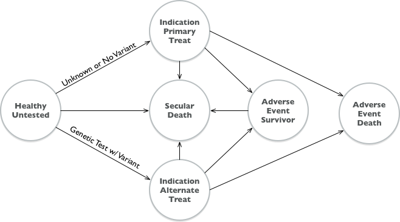

```{r setup, include=FALSE}
knitr::opts_chunk$set(echo = TRUE)

source("simple-params.R")
source("simple-des.R")
source("simple-deq.R")

set.seed(1)

```

## Model Description


* A population of 40-year old women are at risk for both secular death and an indication (A) that happens at a 10% rate over a 10-year period.
* All those who experience the event incur a cost of $10,000.
* Those who experience the event experience a 0.05 utility decrement for 1 year, and are placed on a drug for life that costs $0.5/day.
* There is an adverse event (B) that occurs downstream of indication A, with probability 0.02 over a 1-year period.
* Adverse Event B has a 5% case fatality rate with a $15,000 cost among the decedents and, among the survivors, incurs a $25,000 cost and a 0.1 disutility for life.
* There is a test available that, if the person tests positive for increased risk (prevalence is 0.2), results in an alternative drug (for life) that costs $5/day but reduces the rate of the second event by a relative risk of 0.7.
* Indication and adverse events are not recurrent.
* We are going to compare two strategies: "Reference" (no testing) vs “Testing” (Testing at the time of indication A).
* Standard annual discounting of 0.03 applies.



## Visual comparison of DES and DiffEq

Comparison of DES and Diff Eq solutions to simplest model.

### Indication

```{r compare_ind}
des <- des_simulation(params)
deq <- deq_simulation(params)


par(mfrow=c(1,2))
# Overlay Indicate by DES and DEQ
plot(deq[,'time'], deq[,'a_c']*100,
     type='l', lwd=2,
     ylab='Percent Population', xlab="t (year)", main="Total Indication")
ind.ordered <- sort(des$indication)
sub <- seq(1, length(ind.ordered), by=1000)
lines(ind.ordered[sub]/365, 100*sub/params$n, col='red', lty=2, lwd=2)

# Let's look at A disutility occupancy
plot(deq[,'time'], 100*rowSums(deq[,c('a_dp','a_da')]),
     type='l', lwd=2,
     ylab='Percent Population', xlab="t (year)",
     main="Indication Disutility", ylim=c(0, 1.1))

x <- data.frame(time=c(des$indication, des$cutoff),
                count=c(rep(1,  length(des$indication)),
                        rep(-1, length(des$cutoff))))
x$time[x$time == params$horizon*365] <- NA
x <- x[order(x$time,na.last=NA),]
x$count <- cumsum(x$count)
lines(x$time/365, 100*x$count/params$n, col='red', lty=2)
```

```{r compare_deaths}
par(mfrow=c(1,2))
plot(deq[,'time'], 100*rowSums(deq[,c('a_p','a_a')]),
     type='l', lwd=2,
     ylab='Percent Population', xlab="t (year)", main="Indication Occupancy")
end_of_ind <- pmin(des$adverse, des$death, na.rm=TRUE)
end_of_ind[is.na(des$indication)] <- NA
x <- data.frame(time=c(des$indication, end_of_ind),
                count=c(rep(1,  length(des$indication)),
                        rep(-1, length(end_of_ind))))
x <- x[order(x$time,na.last=NA),]
x$count <- cumsum(x$count)
lines(x$time/365, 100*x$count/params$n, col='red', lty=2)

plot(deq[,'time'], 100*deq[,'b_d'],
     type='l', lwd=2,
     ylab='Percent Population', xlab="t (year)", main="Adverse Deaths")

adv.deaths <- sort(des$adverse_death[!is.na(des$adverse_death)])
sub <- seq(1, length(adv.deaths), by=10)
lines(adv.deaths[sub]/365, 100*sub/params$n, col='red', lty=2, lwd=2)
```

## Compare End Results


```{r results}
rbind(des=des_summary(des, params),
      deq=deq_summary(deq, params))
```


